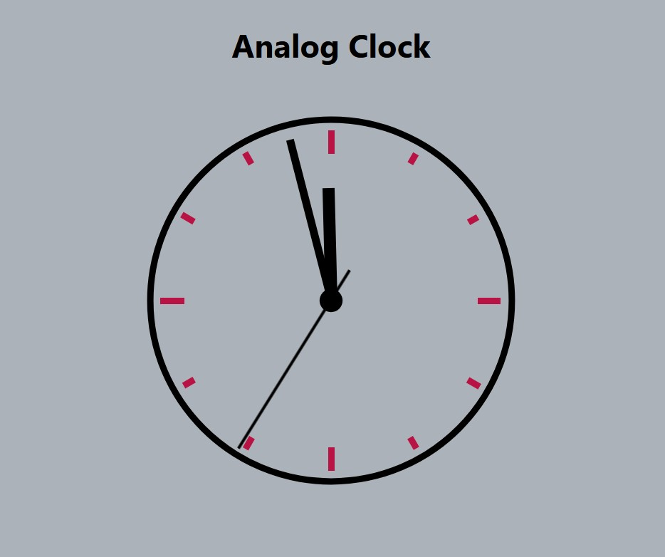

# Analog Clock
[+] Analog Clock Project


### HTML:


```HTML
<!DOCTYPE html>
<html lang="en-US">

<head>
    <meta charset="UTF-8">
    <meta name="viewport" content="width=device-width, initial-scale=1">
    <title>A Digital Analog Clock</title>
    <link rel="stylesheet" href="style.css" type="text/css" media="all">
    <script src="script.js" defer></script>
</head>

<body>
<main class="main">
    
    <div class="clockbox">
        <h1 style="text-align: center; font-size: 45px; font-family: -apple-system, BlinkMacSystemFont, 'Segoe UI', Roboto, Oxygen, Ubuntu, Cantarell, 'Open Sans', 'Helvetica Neue', sans-serif;">Analog Clock</h1>
        <svg id="clock" xmlns="http://www.w3.org/2000/svg" width="600" height="600" viewBox="0 0 600 600">
            <g id="face">
                <circle class="circle" cx="300" cy="300" r="253.9"/>
                <path class="hour-marks" d="M300.5 94V61M506 300.5h32M300.5 506v33M94 300.5H60M411.3 107.8l7.9-13.8M493 190.2l13-7.4M492.1 411.4l16.5 9.5M411 492.3l8.9 15.3M189 492.3l-9.2 15.9M107.7 411L93 419.5M107.5 189.3l-17.1-9.9M188.1 108.2l-9-15.6"/>
                <circle class="mid-circle" cx="300" cy="300" r="16.2"/>
            </g>
            <g id="hour">
                <path class="hour-arm" d="M300.5 298V142"/>
                <circle class="sizing-box" cx="300" cy="300" r="253.9"/>
            </g>
            <g id="minute">
                <path class="minute-arm" d="M300.5 298V67"/>
                <circle class="sizing-box" cx="300" cy="300" r="253.9"/>
            </g>
            <g id="second">
                <path class="second-arm" d="M300.5 350V55"/>
                <circle class="sizing-box" cx="300" cy="300" r="253.9"/>
            </g>
        </svg>
    </div><!-- .clockbox -->
</main>

</body>

</html>
```

___

### CSS:

```CSS

/* Layout */

body{
    background: #abb2b9;
}
.main {
    display: flex;
    padding: 2em;
    height: 90vh;
    justify-content: center;
    align-items: middle;
}

.clockbox,
#clock {
    width: 100%;
}

/* Clock styles */
.circle {
    fill: none;
    stroke:  #000;
    stroke-width: 9;
    stroke-miterlimit: 10;
}

.mid-circle {
    fill: #000;
}
.hour-marks {
    fill: none;
    stroke: rgb(184, 19, 68);
    stroke-width: 9;
    stroke-miterlimit: 10;
}

.hour-arm {
    fill: none;
    stroke: #000;
    stroke-width: 17;
    stroke-miterlimit: 10;
}

.minute-arm {
    fill: none;
    stroke: #000;
    stroke-width: 11;
    stroke-miterlimit: 10;
}

.second-arm {
    fill: none;
    stroke: #000;
    stroke-width: 4;
    stroke-miterlimit: 10;
}

/* Transparent box ensuring arms center properly. */
.sizing-box {
    fill: none;
}

/* Make all arms rotate around the same center point. */
/* Optional: Use transition for animation. */
#hour,
#minute,
#second {
    transform-origin: 300px 300px;
    transition: transform .5s ease-in-out;
}


```
___

### JavaScript:

```javascript
const ghontarhat = document.querySelector("#hour");
const minerhat = document.querySelector("#minute");
const secerhat = document.querySelector("#second");

var date = new Date();
    console.log(date);

    let hr = date.getHours();
    let min = date.getMinutes();
    let sec = date.getSeconds();
    console.log("Hour: " + hr + " Minute: " + min + "Second: " + sec);

    let hrposition = (hr*360/12) + (min*(360/60)/12);
    let minposition = (min*360/60) + (sec*(360/60)/60);
    let secposition = sec*360/60;

function runtheclock(){

    hrposition = hrposition+(3/360);
    minposition = minposition+(6/60);
    secposition = secposition+6;

    ghontarhat.style.transform = "rotate(" + hrposition + "deg)";
    minerhat.style.transform = "rotate(" + minposition + "deg)";
    secerhat.style.transform = "rotate(" + secposition + "deg)";
}

var interval = setInterval(runtheclock, 1000);


```

___

### SS:

[]